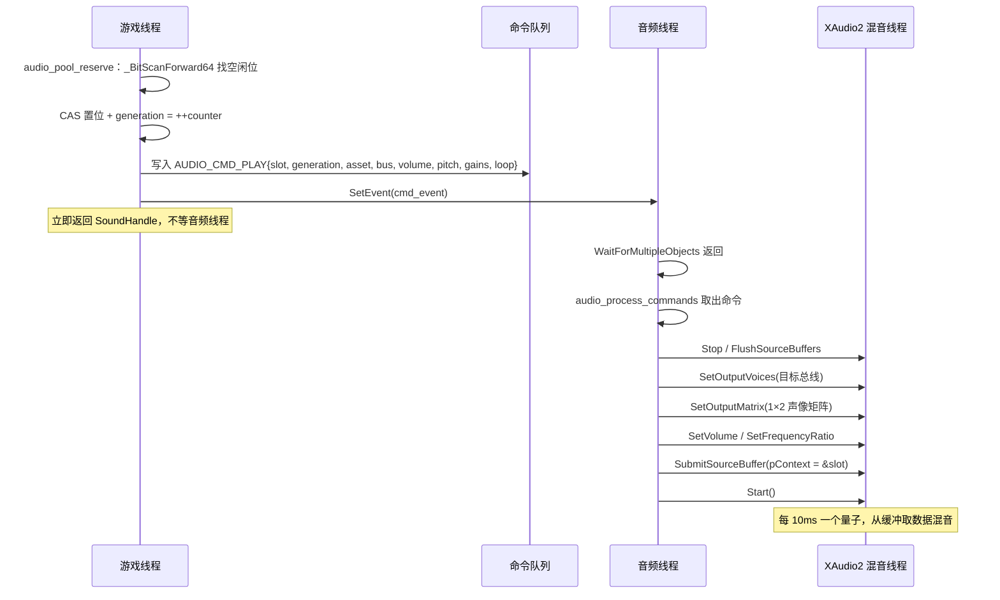
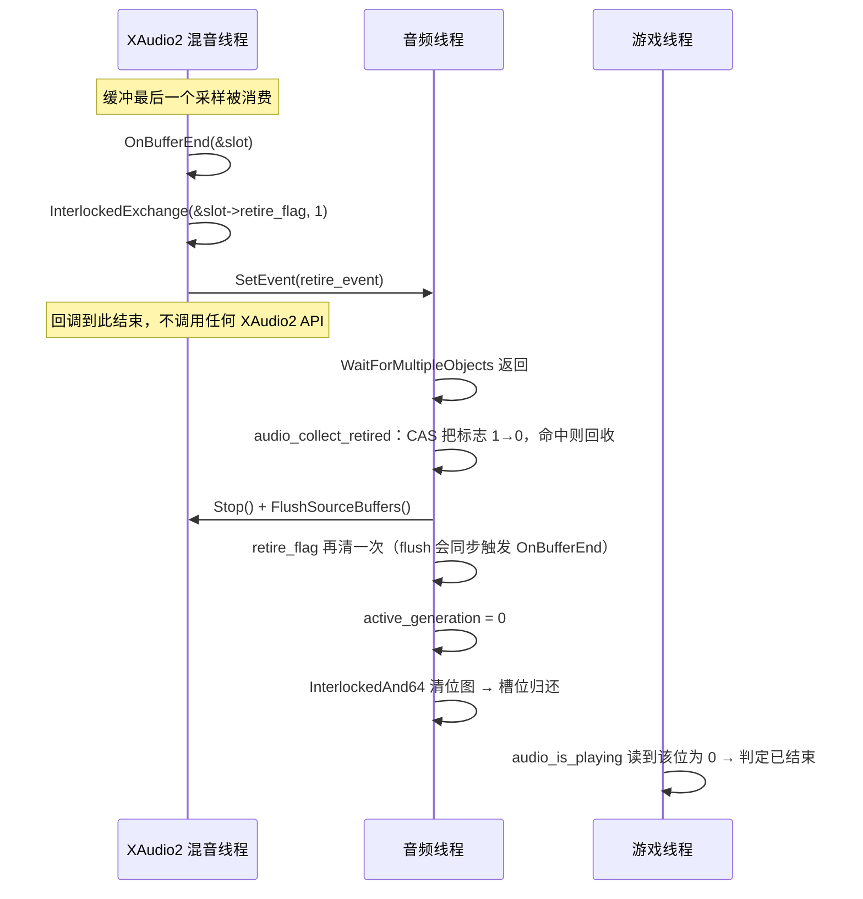

# 音频系统（XAudio2）实现说明

> 本文档对应代码：`include/audio.h`（公共 API）、`src/audio.cc`（全部内部实现与平台类型）、
> `include/game_audio.h` + `src/game_audio.cc`（游戏侧语义与素材解码）、`src/main.cc`（装配点）、`include/shared/mono_math.h` 的 `INV_SQRT_2`。
> 目标是把「行业通行架构 → 本项目的取舍 → 代码落地 → 未来改动方式」串成一条线，方便逐段对照阅读与审查。
> 文中所有 XAudio2 常量与规则均以 Windows 10 SDK `um/xaudio2.h`（10.0.26100.0）与官方文档为准。
>
> **阅读提示（2026-09-20）**：§2–§9 是随实现同步写的参考章节，权威的演进过程在 §13 更新记录。
> §2–§9 里的描述性内容曾落后于 2026-09-19 的「公共头去平台化」重构，已于 2026-09-20 全量校正。
> 其中带 `~~删除线~~` 的条目描述的是 2026-09-18 **之前**的「程序生成测试音」方案（`audio_generate_*` /
> `audio_debug_*` / `audio_apply_fade_envelope`），那些代码已随真实 WAV/OGG 素材的接入而移除；
> 条目保留是因为其中的音频知识（包络、整周期循环、声像归一化、相位回卷）仍然成立。

---

## 目录

1. [名词与原理速查](#1-名词与原理速查)
2. [架构总览](#2-架构总览)
3. [知识矩阵（概念 ↔ 代码链路）](#3-知识矩阵概念--代码链路)
4. [调用链时序详解](#4-调用链时序详解)
5. [API 实现逐项说明](#5-api-实现逐项说明)
6. [设计决策记录（含取舍与代价）](#6-设计决策记录含取舍与代价)
7. [扩展与修改指南](#7-扩展与修改指南)
8. [调试与验证](#8-调试与验证)
9. [已知约束与陷阱清单](#9-已知约束与陷阱清单)
10. [代码审查重点](#10-代码审查重点)
11. [参考资料](#11-参考资料)
12. [附录：常量与结构一览](#12-附录常量与结构一览)
13. [更新记录](#13-更新记录)

---

## 1. 名词与原理速查

### 1.1 名词表

| 名词 | 英文 | 含义 | 在本项目中的体现 |
| --- | --- | --- | --- |
| 引擎对象 | `IXAudio2` | XAudio2 顶层对象，所有 voice 的创建者 | `AudioState::engine` |
| 源声音 | source voice | 音频数据的**入口**，客户端往里提交缓冲 | voice 池里的 `AudioVoiceSlot::voice` |
| 混音总线 | submix voice | 不接收数据缓冲，只**汇聚 + 处理**上游声音 | `bus_voices[BUS_SFX]` 等 |
| 主声音 | mastering voice | 代表**音频输出设备**，把混音结果写进设备 | `bus_voices[BUS_MASTER]` |
| 声音图 | audio graph / voice graph | 所有 voice 及其连线的集合 | `BUS_TABLE` 描述的树 |
| 发送列表 | send list | 一个 voice 的输出目标列表 | `XAUDIO2_VOICE_SENDS`，播放时改路由 |
| 音量 | volume | **线性幅度**，不是分贝 | `SetVolume`，默认值 0.70 等 |
| 输出矩阵 | output matrix / mix matrix | 源声道 → 目标声道的**增益矩阵** | 1×2 矩阵承载声像 + 衰减 |
| 采样率转换 | SRC (Sample Rate Conversion) | 采样率不同的 voice 之间自动重采样 | 全图统一 48000 以避免 |
| 量子 | quantum | 混音器一次处理的时间片，Windows 上 **10ms** | 决定回调粒度与最小延迟 |
| 频率比 | frequency ratio | 播放速率倍率，等价于变调 | `SetFrequencyRatio`，默认上限 2.0 |
| 缓冲 | `XAUDIO2_BUFFER` | 一次提交的 PCM 数据块及其循环/区间参数 | `audio_start_voice` |
| 循环区间 | loop region | `LoopBegin/LoopLength/LoopCount` | 无缝循环 BGM |
| 播放区间 | play region | `PlayBegin/PlayLength`，采样数而非字节 | 预留（未使用） |
| 用户上下文 | `pContext` | 回调里用于**识别是哪个缓冲**的指针 | 指向 `AudioVoiceSlot` |
| 回调 | `IXAudio2VoiceCallback` | 混音线程通知客户端 | `AudioVoiceCallback` |
| 声像 | pan | 声音在左右声道的分布 | `audio_spatial_gains` |
| 等功率定律 | equal-power panning | `cos²θ + sin²θ = 1`，扫过时总功率恒定 | `cosf(theta)` / `sinf(theta)` |
| 距离衰减 | distance rolloff / attenuation | 音量随距离下降的曲线 | 反距离 `1/(1+d/r)` |
| 包络 | envelope (ADSR) | 音量的起落曲线，防爆音 | ~~`audio_apply_fade_envelope`~~（已移除，现由素材端点归零代替） |
| 升余弦窗 | raised cosine fade | `0.5 - 0.5*cos(πt)`，端点导数为 0 最平滑 | 同上 |
| 削波 | clipping | 采样值超出 ±1 被截断 → 失真 | 主总线调到 2.0 可听到 |
| 爆音/咔哒声 | click / pop | 波形突变或直流跳变导致的宽频谱能量 | 由包络与整周期循环规避 |
| 无锁队列 | lock-free SPSC queue | 单生产者单消费者环形队列 | `AudioState::cmd_ring` |
| 原子操作 | atomic / interlocked | 不可被打断的读改写 | `InterlockedIncrement` 等 |
| 内存屏障 | memory barrier | 约束读写重排序 | `InterlockedIncrement` 等 locked 指令自带全屏障，无需单独调用 |
| 世代计数 | generation | 让过期句柄自动失效的版本号 | `SoundHandle::generation` |
| 位图 | bitmask | 用位表示槽位占用 | `AudioVoicePool::in_use_bits` |
| 抢占 | voice stealing | 池满时抢走某个 voice | 未实现，见 R9 |
| 总线分类 | stream category | 告诉系统这条流的用途 | `AudioCategory_GameEffects`（默认值） |

### 1.2 API 风格对比（为什么选 XAudio2）

| API | 数据供给模型 | 现状 | 适用场景 |
| --- | --- | --- | --- |
| DirectSound | push 缓冲 + 通知 | 已废弃 | 历史项目 |
| **XAudio2** | **push 缓冲**（提交 PCM），混音线程回调通知 | Win8+ 内置（`xaudio2_9.dll`） | 游戏内混音，功能/成本平衡最好 |
| WASAPI | 拉取（事件驱动）或轮询，直接对设备 | 现行底层 API | 需要极低延迟/独占模式、自己写混音器 |
| Media Foundation | 面向解码与播放管线 | 现行 | 播放压缩音视频、与系统管线集成 |
| FMOD / Wwise | 中间件，自带工具链与虚拟 voice | 商业授权 | 内容量大、需要音频设计师参与 |

XAudio2 的定位是「**提供混音图与 DSP 骨架，但不提供内容管理**」：它给你 voice、总线、采样率转换、混响、3D 计算（X3DAudio），但**资源加载、voice 池、优先级、总线策略全要自己写**——这也正是本项目实现的内容。

### 1.3 三条必须记住的 XAudio2 图规则

1. **voice 的输入采样率在创建时固定**，之后不能改。
2. **同一个 voice 的所有输出目标的输入采样率必须一致**，否则图非法。
3. **submix 只能发送给「处理阶段（ProcessingStage）比自己更大」的 voice**，否则返回 `XAUDIO2_E_INVALID_CALL`。阶段小的先被处理，信号才能自底向上汇流（叶子 → 分组 → 根）。
   > 这条正是本项目在实现时踩到的坑：最初把阶段按「父小 → 子大」编号，`CreateSubmixVoice` 直接失败。

附加约束：采样率必须是 `XAUDIO2_QUANTUM_DENOMINATOR`(100) 的整数倍（因为 10ms 量子要求整数采样点）；范围 `[1000, 200000]`；声道数上限 64；单缓冲最大 2GB；每个 voice 最多排队 64 个缓冲。

---

## 2. 架构总览

### 2.1 三类线程与职责隔离

```
┌─────────────────────────┐
│ 游戏线程 (wWinMain)     │  产生音频事件；只写命令队列，从不调用 XAudio2
│  game_update 60Hz       │
└───────────┬─────────────┘
            │ 无锁 SPSC 环形队列 (AudioCommand[])
            ▼
┌─────────────────────────┐
│ 音频线程 (audio_thread) │  唯一调用 XAudio2 的地方；消费命令 + 回收播完的 voice
└───────────┬─────────────┘
            │ XAudio2 API
            ▼
┌─────────────────────────┐
│ XAudio2 混音线程        │  每 10ms 一个量子；播完缓冲后回调 OnBufferEnd
└───────────┬─────────────┘
            │ 回调：只置标志 + SetEvent
            └──────────► 回到音频线程
```

| 线程 | 谁创建 | 允许做的事 | 绝对禁止 |
| --- | --- | --- | --- |
| 游戏线程 | 进程主线程 | 读游戏状态、算声像/衰减、占槽位、写命令队列、创建资产 | 直接调用 XAudio2 API、读写 `AudioVoiceSlot` 的非 `generation` 字段 |
| 音频线程 | `audio_init` → `CreateThread` | 调用 XAudio2 API、消费命令、回收槽位 | 阻塞等待游戏线程（会造成卡顿） |
| 混音线程 | XAudio2 内部 | `InterlockedExchange` 置位、`SetEvent` | 调用 XAudio2 API（死锁）、加锁、分配内存、做重活 |

**这条分工的价值**：`DestroyVoice` 会阻塞到混音线程不再使用该 voice，如果放在渲染帧里会造成掉帧；`CreateSourceVoice` 也有分配成本。把 API 调用统一收进音频线程后，游戏线程只做「写 8 字节命令 + SetEvent」，永不阻塞。另外 voice 池化后运行期根本不调用这两个函数。

### 2.2 音频图（本项目实测创建结果）

```
                     ┌────────────────┐
   source voice ────►│ sfx.amb  (阶段0)│──┐
   source voice ────►│ sfx.chr  (阶段0)│──┼──►┌──────────────┐
   source voice ────►│ sfx.imp  (阶段0)│──┘   │ sfx   (阶段1)│──┐
                                              └──────────────┘  │
   source voice ────►│ music    (阶段0)│──────────────────────┐  │
   source voice ────►│ ui       (阶段0)│────────────────────┐ │  │
                                                            ▼ ▼  ▼
                                              ┌───────────────────────┐
                                              │ master (mastering)    │
                                              └──────────┬────────────┘
                                                         ▼
                                                   音频输出设备
```

- 每个 bus 的 `SetVolume` 是**相对父级**的，总增益 = 沿路径各级相乘，**由 XAudio2 自动完成**，代码里不需要手算乘积。
- 因此 `audio_set_bus_gain(BUS_SFX, 0)` 一行就能静音全部音效，而 BGM 不受影响。

### 2.3 代码分层

| 层 | 职责 | 代码位置 |
| --- | --- | --- |
| 游戏/语义层 | 决定「何时、在哪、多响」 | `src/game_audio.cc` 的 `game_audio_play_*` |
| 空间化数学 | 世界偏移 → 左右增益（纯函数） | `audio_spatial_gains` |
| 命令层 | 跨线程传递请求 | `audio_push_command`、`AudioCommand` |
| 播放控制 API | 分配槽位、校验句柄 | `audio_play` / `audio_stop` / `audio_is_playing` / `audio_set_voice_gains` / `audio_set_bus_gain` |
| 实例层 | voice 槽位与生命周期 | `AudioVoicePool`、`AudioVoiceSlot`、`audio_release_slot` |
| 资源层 | PCM 资产（不可变、可共享） | `SoundAsset`、`src/game_audio.cc` 的 `load_wav` / `load_ogg` / `load_asset` |
| 路由层 | 总线树 | `BUS_TABLE`、`audio_create_buses` |
| 设备层 | 引擎与设备输出 | `audio_create` / `audio_destroy` |

---

## 3. 知识矩阵（概念 ↔ 代码链路）

阅读顺序建议：按表格自上而下，每行都能在代码里找到落点。

### 3.1 设备与路由层

| 概念 / 原理 | 代码位置 | 为什么这么写 | 代价与边界 |
| --- | --- | --- | --- |
| `XAudio2Create` 创建引擎 | `audio_init`（内部，由 `audio_create` 调用） | Win10 SDK 里它是内联函数，会先尝试 `XAudio2CreateWithVersionInfo` 再回退，自动拿到 `xaudio2_9.dll` | 失败原因通常是系统缺少 XAudio2 组件 |
| 总线统一 48kHz | `AUDIO_SAMPLE_RATE` | 总线与 mastering 同率，且 48000 能被 100 整除，满足量子约束 | 设备原生 44100 时由 mastering voice 做一次固定速率 SRC |
| 资产保留原生采样率 | `AUDIO_POOL_TABLE` 的 `sample_rate` | source voice 的输入格式创建时固定，所以「池 = 允许的格式清单」；资产与总线不同率时由 **源 voice 的 SRC** 自动转换，素材零预处理 | 播放中的 voice 各有一份 SRC 开销（本项目只有 3 个音，可忽略）；将来若追求零 SRC，应在内容管线里离线烘焙到 48k |
| 总线固定 2 声道 | `AUDIO_BUS_CHANNELS` | 让输出矩阵恒为 1×2 或 2×2，逻辑简单；设备是 5.1/7.1 时由 mastering voice 的混音矩阵处理 | 未来要做环绕声声像需要改这里 |
| 总线表数据驱动 | `BUS_TABLE` | 新增总线只改表；数组顺序即拓扑序，父先于子 | 表顺序错了会被 `assert(BUS_TABLE[i].parent < i)` 拦住 |
| 处理阶段自底向上 | `audio_create_buses` 里的反向遍历 | 满足「发送方阶段 < 接收方阶段」，叶子 0 → 分组 1 → 根 | 层次越深阶段越大；同一阶段内顺序不保证 |
| 音量级联 | 各级 `SetVolume` | XAudio2 图自动相乘，代码零负担 | 需要人肉推导「最终增益」时容易算错，调试时按路径相乘 |
| 调试日志 | `SetDebugConfiguration`（`MONO_DEBUG_BUILD`） | 把 XAudio2 内部告警输出到调试器 | 必须挂着调试器才看得到；`TraceMask` 只开 ERROR/WARNING 以免刷屏 |
| 关闭顺序 | `audio_destroy` | 停线程 → 流式槽位（含解码器）→ 源 voice → 总线 → 事件句柄 → 引擎 | 事件句柄必须最后关：`DestroyVoice` 期间回调仍可能 `SetEvent` |

### 3.2 实例与生命周期

| 概念 / 原理 | 代码位置 | 为什么这么写 | 代价与边界 |
| --- | --- | --- | --- |
| voice 池化 | `AUDIO_POOL_TABLE`、`audio_create_pools` | 运行期不再 `Create/DestroyVoice`，避免阻塞与分配 | 池满时需要策略，目前只是丢弃 + 告警 |
| 按格式分池 | `AudioPoolDesc` | source voice 的输入格式创建后固定，立体声资产无法复用单声道 voice | 当前池表 = `{1,48000,8}` `{2,44100,8}` `{2,32000,4}`；没有匹配格式就直接报错拒绝播放 |
| 位图 free list | `audio_pool_reserve` | 64 个槽位只占 8 字节，`_BitScanForward64` + CAS 免锁占位 | 上限 64，超过需换 free list |
| 世代计数 | `SoundHandle::generation`、`audio_is_playing` | 命令是**异步**的，期间槽位可能被复用；世代不符即安全忽略 | `generation` 归零即代表无效句柄 |
| 字段所有权约定 | `src/audio.cc` 里 `AudioVoiceSlot` 上方的注释 | 用文档级约定代替锁：谁的字段谁写，跨线程只碰位图 | 破坏约定不会有编译错误，只能靠审查 |
| 播放时改路由 | `SetOutputVoices` | 池化 voice 创建时不绑定总线，播放时按请求改接 | 只能在 voice 未运行时调用，所以先 `Stop+Flush` |
| 归还前清标志 | `audio_release_slot` | `FlushSourceBuffers` 会**同步**再触发 `OnBufferEnd`，必须在其后清位 | 顺序写反会导致新播放刚起播就被回收 |
| 回调上下文 | `buffer.pContext = slot` | 槽位位于 `AudioState` 内，地址恒定，可直接当身份标识 | 池数组不能被移动/重分配 |

### 3.3 播放控制与数据

| 概念 / 原理 | 代码位置 | 为什么这么写 | 代价与边界 |
| --- | --- | --- | --- |
| 静态缓冲 + 循环区间 | `buffer.LoopBegin/LoopLength/LoopCount` | 无限循环由混音器完成，**无缝且不依赖回调** | 需要整段常驻内存，因此只适合短音效；长音频改走流式（见 R5） |
| `XAUDIO2_END_OF_STREAM` | 一次性播放分支 | 标记流结束，配合 `OnBufferEnd` 判定播完 | 循环分支不能加，否则语义冲突 |
| 输出矩阵承载声像 | `SetOutputMatrix(nullptr, 1, 2, matrix)` | 矩阵项就是增益，一次调用同时完成声像 + 衰减，省一次 `SetVolume` | 索引公式是 `pLevelMatrix[S + SourceChannels * D]`，不是行优先 |
| 频率比变调 | `SetFrequencyRatio`（`params.pitch`） | 变速即变调，可用于音高随机化与慢动作 | `MaxFrequencyRatio` 默认 2.0，超出要显式放大创建参数 |
| 音量语义 | `AudioPlayParams::volume` | `SetVolume` 是**线性幅度**，范围 `[0, 2^24]`；人耳是对数的 | 做「音量滑条」时要 `10^(dB/20)` 换算 |
| 等功率声像 | `audio_spatial_gains` | `cos/sin` 保证扫过时总功率恒定，中心不塌陷 | 中心值为 0.7071 而非 1.0（−3dB） |
| 反距离衰减 | 同上 | `1/(1+d/r)` 更接近真实声源；`min_gain` 做远场地板 | 需要调 `rolloff_radius`；小于 0 的增益非法 |
| ~~升余弦包络~~ | ~~`audio_apply_fade_envelope`~~ | 端点值为 0 且导数连续，频谱泄漏最小，最不易爆音 | 会占用一点时长，短音需缩短短时长 |
| ~~整周期循环~~ | ~~`audio_generate_loop_tone`~~ | 频率吸附到 `整周期数/时长`，缓冲首尾相位连续 | 只适用于**周期性**波形，噪声类不适用 |
| ~~单缓冲多分音归一化~~ | ~~`audio_generate_chord`~~ | 每分音 `1/count` 增益，叠加峰值不超过 amplitude | 实际响度会低于同增益单音（相位相消） |
| ~~相位回卷~~ | ~~`audio_generate_tone`~~ 循环内 | f32 相位长时间累加会丢精度，回卷到 `[0, 2π)` | 回卷分支带来极小的分支开销 |

### 3.4 线程与并发

| 概念 / 原理 | 代码位置 | 为什么这么写 | 代价与边界 |
| --- | --- | --- | --- |
| 单生产者单消费者环形队列 | `AudioCommand`、`cmd_ring`、`audio_push_command`、`audio_process_commands` | 免锁、容量固定、无分配，最坏情况可预测 | 必须是**单**生产者；目前由 WndProc 与渲染循环同属主线程，成立 |
| 发布屏障 | 先写命令内容，再 `InterlockedIncrement(&cmd_tail)` 发布 | 先写内容后发布 tail；`Interlocked*` 是 locked 指令、自带全屏障，所以不需要再写 `MemoryBarrier()` | 反过来写会出现「读到半个命令」 |
| 事件精确唤醒 | `cmd_event` / `retire_event` / `WaitForMultipleObjects(..., INFINITE)` | 不轮询，零无效唤醒；`SetEvent` 不会丢信号 | 无周期性兜底，若将来需要定时任务要加超时 |
| 自动重置事件 | `CreateEventW(nullptr, FALSE, ...)` | 一次唤醒一个等待者，配合无锁队列天然正确 | 手动重置事件会破坏该语义 |
| 队列满的降级 | `dropped_cmd_count` | 游戏线程**绝不阻塞**，宁可丢命令 | 正常情况计数应恒为 0，非 0 说明队列太小或消费卡住 |
| 回调最小化 | `AudioVoiceCallback::OnBufferEnd` | 混音线程不能阻塞，只做标志 + 唤醒 | 任何 API 调用（尤其 `DestroyVoice`）都可能死锁 |
| 回调接口的继承 | `struct AudioVoiceCallback : IXAudio2VoiceCallback` | SDK 限制，必须实现纯虚接口——这是本项目唯一的继承/虚函数 | 用 `override` 保证签名与 SDK 一致，签名写错编译期即报错 |
| 回调对象生命周期 | `AudioState::callback` | XAudio2 **不管理**回调对象生命周期，它必须比所有 voice 活得久 | 不能是临时对象，也不能随 voice 提前析构 |

---

## 4. 调用链时序详解

### 4.1 启动链

```
wWinMain
 └─ windows_start_init()            log_init → arena_init(1GB) → DPI 感知
 └─ CreateWindowExW                 无边框全屏（`--window` 时是窗口模式）
 └─ input_init(hwnd)                选后端：GameInput → Win32 降级（只选一次）
 └─ renderer_create(hwnd, w, h)     D3D12 设备/队列 + 交换链 + 根签名/PSO + 纹理表
 └─ audio_create()                  arena 上 placement new 构造 AudioState，内部调 audio_init
     ├─ XAudio2Create                       → engine
     ├─ SetDebugConfiguration               (仅 MONO_DEBUG_BUILD)
     ├─ sample_rate = 48000
     ├─ audio_create_buses()
     │   ├─ CreateMasteringVoice(2ch, 48000) → bus_voices[BUS_MASTER]
     │   ├─ 反向遍历算 bus_stage[]（叶子 0 → 根最大）
     │   └─ 按表顺序 CreateSubmixVoice(..., bus_stage[i], send→parent)  → 共 6 条
     ├─ audio_create_pools()                 → 按池表建 8 + 8 + 4 = 20 个 f32 voice + 回调
     ├─ CreateEventW × 4                     → cmd / retire / chunk / quit
     └─ CreateThread(audio_thread_proc)      → 音频线程开始跑
 └─ game_audio_init(audio)          解析 WAV / OGG 素材（arena 常驻）+ 起播流式 BGM
 └─ game_init_asset(&game_state, client_w, client_h)   关卡 + 精灵图解码（scratch 解码完 reset）
```

### 4.2 一次 `audio_play` 的完整链路



### 4.3 一次「播放结束」的完整链路（本项目核心机制）



关键点：**回调不负责释放，只负责「报告」**。真正的 `Stop/Flush/清位` 都在音频线程上做，因此回调里没有任何可能阻塞或死锁的调用。

### 4.4 每帧空间化更新链

> 现状（2026-09-19）：这条链**尚未接上**。当前三个音都是全局音（不跟随世界坐标），
> 由 `game_audio_play_*` 直接播放，因此没有每步的空间化更新。下面记录的是接上后的形态。

```
固定步长循环 (60Hz)
 └─ game_update(...)
 └─ game_audio_update(&game_state)          ← 待接入（当前不存在）
     ├─ audio_is_playing(handle)               读位图 + 世代（无锁）
     ├─ audio_spatial_gains(源 - 摄像机, ...)   纯计算，得到左右增益
     └─ audio_set_voice_gains(handle, l, r)     写命令队列
         └─ 音频线程 → SetOutputMatrix(1×2)     每帧更新声像与衰减
```

放在**固定步长**里而非渲染循环，是为了与逻辑同步：渲染帧率可变、回放时帧数也可能不同，放渲染层会让回放声音与录制时不一致。

### 4.5 关闭链（顺序不可随意调换）

```
wWinMain 的收尾段
 └─ input_shutdown()
 └─ audio_destroy(audio)                     ← 必须早于 log_shutdown
     ├─ running = 0; SetEvent(quit_event)
     ├─ WaitForSingleObject(audio_thread)   ← 先停线程，之后回到单线程语境
     ├─ CloseHandle(audio_thread)
     ├─ 释放所有流式槽位                    ← Stop + DestroyVoice + close 解码器 + 归还位图
     ├─ 销毁所有源 voice                    ← 期间仍可能触发 OnBufferEnd，故事件句柄还不能关
     ├─ 销毁所有总线 voice（含 mastering）
     ├─ CloseHandle(cmd/retire/chunk/quit)  ← 四个事件
     └─ engine->Release()
 └─ trace_close() / renderer_destroy() / scratch_shutdown()
 └─ log_shutdown()                          ← 必须排在音频之后，音频线程会写日志
```

---

## 5. API 实现逐项说明

### 5.1 `include/audio.h`

| 声明 | 作用 | 实现要点 |
| --- | --- | --- |
| `enum BusId` | 总线编号，数组顺序 = 拓扑序 | `BUS_MASTER` 必须是 0，`audio_create_buses` 从 1 开始建 |
| `enum AudioPoolId` | voice 池编号 | 与 `AUDIO_POOL_TABLE` 一一对应：单声道 48k / 立体声 44.1k / 立体声 32k |
| ~~`AUDIO_MAX_VOICES_PER_POOL`~~ | 池容量上限 64 | 已移入 `src/audio.cc`（实现细节）；与 `LONG64` 位图宽度一致 |
| ~~`AUDIO_CMD_RING_CAP`~~ | 命令队列容量 512 | 已移入 `src/audio.cc`（实现细节）；2 的幂，用掩码取模 |
| `AUDIO_BUS_CHANNELS` / `AUDIO_SAMPLE_RATE` | 全图统一格式 | 见 3.1 |
| `INV_SQRT_2`（定义在 `shared/mono_math.h`） | 等功率中心增益 1/√2 ≈ 0.7071 | `AudioPlayParams::gains` 的默认值 |
| `SoundAsset` | 不可变 PCM 资产 | `(channels, sample_rate)` 必须精确匹配 `AUDIO_POOL_TABLE` 里的某个池，否则 `audio_play` 报错并返回无效句柄 |
| `SoundHandle` | 三字段句柄 | `generation == 0` 即无效（没有单独的校验函数） |
| `StereoGains` | 左右增益 | 空间化输出类型 |
| `AudioPlayParams` | 播放参数（含默认值） | 有默认值，调用方只需填关心的字段 |
| `AudioVoiceSlot` | 槽位（固定地址） | 定义在 `src/audio.cc`，其上方注释写明字段所有权 |
| `AudioVoicePool` | 池 | `valid_mask` 用于位图边界裁剪；`in_use_bits` 是跨线程唯一共享字段 |
| `AudioCmdKind` / `AudioCommand` | 命令与类型标签 | 用扁平结构（非 union），换取可读性与可调试性 |
| `AudioVoiceCallback` | 回调实现 | 6 个方法空实现 + `OnBufferEnd` 两行（共 7 个回调方法） |
| `AudioState` | 全部状态（不透明） | 公共头只有前向声明，完整定义在 `src/audio.cc`；由 `audio_create` 在 arena 上构造后交给 `audio_init` 填充 |

> 注（2026-09-19）：`AudioVoiceSlot` / `AudioVoicePool` / `AudioStreamSlot` / `AudioCmdKind` / `AudioCommand` /
> `AudioVoiceCallback` / `AudioStreamCallback` 以及容量常量现在**都定义在 `src/audio.cc`** —— 它们含
> XAudio2 / COM / Win32 类型，`include/audio.h` 已改为不含任何平台头，跨平台时只替换实现文件。
> 上表保留它们，是为了记录「概念落在哪个环节」。

### 5.2 `src/audio.cc`

| 函数 | 角色 | 说明 |
| --- | --- | --- |
| `audio_spatial_gains` | 纯函数 | 等功率声像 + 反距离衰减；策略参数由调用方传入，音频层不认识游戏概念 |
| `audio_find_pool` | 查表 | 按资产的 (声道数, 采样率) 精确匹配池，找不到返回 -1 并提示补池表 |
| `audio_make_float_format` | 共用工具 | 构造交错 f32 的 `WAVEFORMATEX`（池化与流式两条路径共用） |
| `audio_bind_output` | 共用工具 | 接目标总线 + 设置输出矩阵（单声道 1×2 声像 / 立体声 2×2 恒等），池化与流式共用 |
| `audio_bitmap_reserve` | 共用工具 | 免锁位图占位（`_BitScanForward64` + CAS）；归还用 `InterlockedAnd64`、原子读用 `InterlockedOr64`，没有单独封装的函数（voice 池与流式槽位共用） |
| `audio_push_command` | 生产者 | 队列满则计数丢弃；成功后 `SetEvent` |
| `audio_release_slot` | 音频线程 | Stop + Flush + 清标志 + 清位图 |
| `audio_start_voice` | 音频线程 | 复用槽位的完整启动序列（见 4.2） |
| `audio_stop_voice` | 音频线程 | 校验 `active_generation`，防止过期命令停错声音 |
| `audio_apply_gains` | 音频线程 | 更新 1×2 输出矩阵（立体声池直接返回，其增益走 volume） |
| `audio_apply_bus_gain` | 音频线程 | 设置总线 voice 音量（级联由图层完成） |
| `audio_execute_command` / `audio_process_commands` | 音频线程 | 命令分发与环形队列消费 |
| `audio_collect_retired` | 音频线程 | 扫描 `retire_flag` 并回收 |
| `audio_stream_release` | 音频线程 | 流结束/停止：Stop + Flush + DestroyVoice + `close` 解码器 + 归还位图 |
| `audio_stream_fill_queue` | 音频线程 | 按 `BuffersQueued` 把数据块补到上限（环形块缓冲轮转写入） |
| `audio_start_stream` / `audio_stop_stream_now` / `audio_service_streams` | 音频线程 | 流的启动、停止、以及每次唤醒后的补块与回收 |
| `audio_thread_proc` | 线程入口 | 四句柄等待（命令 / voice 播完 / 流式块播完 / 退出）+ 命令处理 + 回收 + 补块；提权到 ABOVE_NORMAL |
| `audio_create_buses` | 初始化 | 阶段计算 + 总线创建 + 默认音量 |
| `audio_create_pools` | 初始化 | 按池表格式批量建 voice（每池一个格式） |
| `audio_init` / `audio_destroy` | 生命周期 | `audio_init` 是内部函数，对外入口是 `audio_create`；见 4.1 / 4.5 |
| `audio_pool_reserve` | 游戏线程 | 免锁占位 + `generation` 自增 |
| `audio_play` / `audio_is_playing` / `audio_stop` / `audio_set_voice_gains` / `audio_set_bus_gain` | 游戏线程 API | 只做校验 + 组装命令 + 入队（没有 `audio_handle_valid`，无效句柄靠 `generation == 0` 判断） |
| `audio_play_stream` / `audio_is_stream_playing` / `audio_stop_stream` | 游戏线程 API | 流式播放的三个入口；两个查询都是原子读各自的位置图 |

### 5.3 `src/main.cc` 中的接线点

| 位置 | 作用 |
| --- | --- |
| `wWinMain` 内 `AudioState *audio = audio_create()` | 音频不可用时返回 `nullptr`，只降级为静音，不影响游戏启动 |
| `game_audio_init(audio)` | 紧接 `audio_create` 之后：解析素材并起播 BGM |
| 收尾段 `audio_destroy(audio)` | 早于 `log_shutdown`；对 `nullptr` 与半初始化状态都安全 |
| `src/game.cc` 调 `game_audio_play_coin()` / `game_audio_play_dash()` | 游戏逻辑只认识语义函数，不接触任何音频数据类型 |
| `game_audio_toggle_bgm()` | 暂停 / 恢复 BGM 的调试入口（**目前没有按键绑定，是个孤儿函数**，要么绑键要么删掉） |

---

## 6. 设计决策记录（含取舍与代价）

| # | 决策 | 备选 | 选择理由 | 代价 |
| --- | --- | --- | --- | --- |
| D1 | 独立音频线程 + 命令队列 | 游戏线程直接调用 XAudio2 | XAudio2 API 本身线程安全，但 `Create/DestroyVoice` 会阻塞；池化 + 独立线程让游戏线程永不阻塞 | 多约 120 行线程/队列代码 |
| D2 | 回调回收（`OnBufferEnd` + flag + event） | 每帧轮询 `GetState()` | 精确、零轮询开销；且为将来「流式续块」留好了通知通道 | 必须实现 SDK 的纯虚接口（本项目唯一继承），并严格遵守回调三条铁律 |
| D3 | 静态缓冲 + 循环区间 | 手工流式分块 | 无缝循环由混音器完成，代码最少、抖动最小 | 长音频需整段常驻内存；BGM 因此另走流式路径（见 R5） |
| D4 | voice 池 + 位图占位 | 每次播放创建 voice | 运行期零创建/销毁、零阻塞；位图免锁且仅 8 字节 | 池上限 64，需要溢出策略（当前丢弃 + 告警） |
| D5 | 两级总线树 | 全部直连 mastering | 分组音量/静音一行搞定；为后续分组效果器留位置 | 多 6 个 submix 的处理开销；受「阶段必须递增」约束 |
| D6 | 游戏线程算声像/衰减 | 音频线程算（下发世界坐标） | 音频层与游戏概念彻底解耦；少一层坐标同步 | 空间化策略参数（pan_width 等）放在游戏侧，音频库不自带曲线 |
| D7 | 总线与 mastering 统一 48kHz / 2 声道 | 上游各自采样率 | 总线图内部不触发 SRC；矩阵恒为 1×2/2×2 | 素材保留原生采样率，所以每个播放中的源 voice 各承担一次 SRC |
| D8 | 协议用扁平 `AudioCommand` | union / 虚函数分派 | 可读、可调试、无隐式行为（符合项目风格） | 单条命令约 96 字节（内嵌的 `AudioStreamSource` 本身就占 48 字节），512 条约 48KB，相对 1GB arena 可忽略 |
| D9 | 音量用线性幅度而非 dB | 直接暴露 dB | 与 XAudio2 语义一致，避免隐式换算 | 调音滑条需要自己做 `10^(dB/20)` |
| D10 | 内部 PCM 统一 f32 | PCM16 | 与内部混音格式一致，解码端不需要再做量化转换 | 内存是 PCM16 的两倍（48kHz 单声道约 192KB/s） |
| D11 | 音频失败不致命 | 失败即退出 | 没有输出设备时游戏仍应可运行 | 调用方只需判断 `audio_create()` 是否返回 `nullptr`，不要去读内部字段 |

---

## 7. 扩展与修改指南

### R1 新增 / 调整总线

1. 在 `enum BusId` 的**子总线区块**加枚举值（保持父在子前）。
2. 在 `BUS_TABLE` 同一相对位置补一行 `{ 父总线, 默认增益 }`（`BusDesc` 只有这两个字段）。
3. 什么都不用改：阶段由 `audio_create_buses` 反向遍历自动算出。

注意事项：`BUS_TABLE` 的顺序即创建顺序，`assert(BUS_TABLE[i].parent < i)` 会在顺序写错时立即中断。

### R2 把音效接入真实游戏事件（替换测试骨架）

```cpp
// 在 game.cc 的 game_update 内（固定步长）触发，例如着地、受伤。
// 只调语义层，游戏逻辑不接触 SoundAsset / AudioPlayParams / BusId。
if (landed) {
    game_audio_play_footstep();  // 内部：查表取资产 → 组装 AudioPlayParams → audio_play
}
```

要点：
- **触发点必须在 `game_update`**（固定步长），不要放在渲染循环，否则 `include/debug/replay.h` 回放时声音无法复现。
- 音频**只读** `GameState`，绝不写回，否则破坏确定性。
- 需要时加**同帧限流**（同一音效同帧最多 N 次），否则密集碰撞会把池打满；在游戏侧维护「上一逻辑步已播放次数」即可。
- 若音效要跟随某个世界坐标，把该坐标也记在游戏侧，并按 4.4 的方式每步 `audio_set_voice_gains`。

### R3 启用立体声池（导入立体声 BGM）—— 已完成（2026-09-18）

池表已按 `(声道数, 采样率)` 键控（当前三行），`audio_play` 走 `audio_find_pool` 精确匹配。
下面保留的是当初的四步，供将来再添格式时照做：

1. 在 `AUDIO_POOL_TABLE` 增加一行 `{ 声道数, 采样率, voice 数 }`。
2. 在 `enum AudioPoolId` 补对应的枚举值（放在 `AUDIO_POOL_COUNT` 之前）。
3. `audio_play` 不需改：它已经按 `(channels, sample_rate)` 选池。
4. 输出矩阵按声道数分支（已在 `audio_bind_output` 内实现）：
   - 单声道池：1×2 矩阵 `{gain_l, gain_r}`（现状）。
   - 立体声池：2×2 恒等矩阵 `{1, 0, 0, 1}`，音量走 `SetVolume`。

注意 2×2 矩阵的索引公式是 `pLevelMatrix[S + SourceChannels * D]`（`S` 是源声道、`D` 是目标声道），不是行优先，写错会导致左右串声。

### R4 从 WAV 文件加载资产 —— 已完成（2026-09-18，用 dr_wav）

实现落在 `src/game_audio.cc` 的 `load_wav` / `load_ogg` / `load_asset`（不再自己解析 RIFF）。
下面保留的是当初的三步，供将来换解码库时参考：

1. 复用项目里的 `read_file` 读入整个文件。
2. 解析 RIFF/WAVE：定位 `fmt `（`wFormatTag` / `nChannels` / `nSamplesPerSec` / `wBitsPerSample`）与 `data` 块。
3. 两种接法：
   - **转成 f32 单声道**（推荐，可直接进现有单声道池）：按声道降混、`sample/32768.0f` 归一化，内存来自 `arena_push`。
   - **保留 PCM16 原格式**：给 `WAVEFORMATEX` 用 `WAVE_FORMAT_PCM`、`wBitsPerSample = 16`，此时必须为该格式单独建池（池的格式是创建时固定的）。
4. 循环 BGM 若要用 R3 的无缝循环特性，需要素材本身首尾相接（音乐通常如此），否则在 loop 点上会听到咔哒。

### R5 流式长音频（几分钟 BGM / 语音）

**已实现**（见 §13 更新记录），实现在「游戏侧提供数据源 + 音频线程按块填充」两层：

- 引擎侧：`AudioStreamSource`（`chunk_buffer` / `chunk_frames` / `chunk_count` / `fill` / `close`）+ `audio_play_stream` / `audio_is_stream_playing` / `audio_stop_stream`，
  音频线程用 `XAUDIO2_VOICE_STATE.BuffersQueued` 判断何时补块，并在 `BufferedQueued == 0`（断流）时调用 `Discontinuity()`。
- 游戏侧：`src/game_audio.cc` 的 `BgmStream` + `bgm_stream_fill`（循环流在文件末尾用 `stb_vorbis_seek_start` 回绕，块边界无缝）+ `bgm_stream_close`。

若将来要**从磁盘**流式（而不是常驻压缩数据），只需把 `fill` 的实现换成读文件 + 增量解码；
引擎侧的接口不需要改动（数据源描述里已经含 `user` 与回调）。

> 常驻型与流式型的分工：短音效常驻解码后的 PCM（起播零延迟，内存本来就小）；
> 长音频只常驻压缩数据（内存省一个数量级），代价是每块的解码发生在音频线程上。

### R6 音高随机化与慢动作变调

- 播放时随机：`params.pitch = 0.95f + 0.1f * r`。
- 运行中变速（例如慢动作）：新增 `AUDIO_CMD_SET_PITCH` 命令 + `audio_set_voice_pitch()`，音频线程调用 `SetFrequencyRatio`。
- 上限约束：`CreateSourceVoice` 的 `MaxFrequencyRatio` 目前是 `XAUDIO2_DEFAULT_FREQ_RATIO`(2.0)。需要更大幅度（如 0.25 倍速）要改这个参数；`SetFrequencyRatio` 的合法下界是 `1/1024`。

### R7 暂停 / 失焦静音

- 推荐：`audio_set_bus_gain(BUS_MASTER, 0.0f)`（图层继续跑，恢复无重新起播成本）。
- 备选：`engine->StopEngine()` 会让混音线程停机，恢复时 `StartEngine()`，适合长时间挂起以省电。
- 失焦信号来自 `WM_ACTIVATE` / `WM_KILLFOCUS`，与现有 `WM_SETCURSOR` 处理鼠标显隐的方式一致。

### R8 加混响 / 效果器

- SDK 自带两个效果：`XAudio2CreateReverb()` 与 `XAudio2CreateVolumeMeter()`（需要 `xaudio2fx.h` + `xaudio2fx.lib`，Win10 SDK 已附带）。
- 用法：构造 `XAUDIO2_EFFECT_DESCRIPTOR` + `XAUDIO2_EFFECT_CHAIN`，在 `CreateSubmixVoice` 传入，或之后用 `IXAudio2Voice::SetEffectChain` 替换；参数用 `SetEffectParameters`。
- 更自然的做法是「干湿分离」：`XAUDIO2_SEND_DESCRIPTOR` 支持一个 voice 发送到多个目标，把音效同时送给「总线」和「混响总线」，混响总线再送 master，此时混响总线的 `ProcessingStage` 必须比音效总线更大。
- 自定义音量表/限幅器需要自己实现 `IXAPO`（音频处理对象），属于 C 档复杂度。

### R9 池满时的抢占策略与虚拟 voice

现状：池满即丢弃并 `LOG_WARN`（正常情况不该发生）。若音效密集：

1. **抢占**：在 `audio_pool_reserve` 失败时，挑一个「音量最低且启动最早」的槽位，标记为抢占目标，把命令交给音频线程执行 `audio_stop_voice` 后复用。
   - 需要记录启动时间戳（可用逻辑步计数）与优先级，作为 `AudioPlayParams` 的新字段。
2. **虚拟 voice**：超限的播放只记账（记录开始时间与音量）不真正占 voice，等到有槽位空出再「接续」播放——这是 Wwise 的核心机制之一，代价是要维护虚拟播放的进度模型。

### R10 3D 音频（若将来改为俯视 3D 或第三人称）

- 目前是「2D 等功率声像 + 距离」，等价于把听者与声源都压到同一个平面上。
- 升级路径：使用 X3DAudio（`x3daudio.lib`，随 XAudio2 提供）：构造 `X3DAUDIO_LISTENER` / `X3DAUDIO_EMITTER`，调用 `X3DAudioInitialize` + `X3DAudioCalculate` 得到 2×2（或 5.1/7.1）矩阵与距离/多普勒，再喂给 `SetOutputMatrix`。
- 前提是总线声道数要跟输出布局匹配，届时需改 `AUDIO_BUS_CHANNELS` 并重建总线的输出矩阵逻辑。

### R11 设备变更（拔耳机、切默认设备）

- XAudio2 不会自动迁移到新设备，播放中的 voice 可能返回 `XAUDIO2_E_DEVICE_INVALIDATED`（0x88960004）。
- 通行做法：注册 `IMMNotificationClient` 监听默认设备变化，或定期检查设备有效性；变化时**销毁并重建整个引擎与音频图**。
- 本项目当前未处理，属已知约束（见 9.6）。

---

## 8. 调试与验证

### 8.1 日志关键字

运行后查看**进程工作目录**下的 `game.log`（UTF-8；从仓库根启动就是仓库根的 `game.log`），关键行：

| 日志 | 含义 |
| --- | --- |
| `audio: <步骤> failed (HRESULT 0x........)` | 初始化失败点与错误码（`XAudio2Create` / `CreateEventW` / `CreateThread` 等共用这一条） |
| `Audio: voice pool create (N channels M Hz, K voice count)` | 池逐个创建详情（**`LOG_DEBUG`**，需任意调试宏开启） |
| `Audio: 没有匹配 (N 声道 M Hz) 的 voice 池...` | 资产格式没有对应池，需要往 `AUDIO_POOL_TABLE` 加一行 |
| `Audio: voice 池已满，丢弃本次播放请求` | 回收失效或音效过密（正常情况下应为 0 次） |
| `Audio: 流式槽位已满，丢弃本次流式播放请求` | 同时在播的流式音源超过 `AUDIO_STREAM_COUNT` |
| `Audio: 流式数据源没有可播放数据，放弃本次流式播放` | 首块解码返回 0 帧（文件截断或 `fill` 写错） |
| `Audio: 音频系统不可用，跳过音频素材加载` | `audio_create()` 返回了 `nullptr`（无输出设备），游戏继续静音运行 |
| `Audio: WAV / OGG 解析失败 ...` | 素材解码失败的具体文件与原因 |
| `Audio: 背景音乐停止（流式）` | `game_audio_toggle_bgm()` 生效 |

> 注意：`log_write` 只在 `>=WARN` 时立即落盘，`LOG_INFO` 要等显式 flush 或正常退出才写出。
> 所以进程崩溃后日志可能是空的，**不能用「日志为空」反推崩溃点**。

### 8.2 调试按键

**当前没有音频专用调试按键**（早期那套 F1/F2/F3/F4 生成音、1/2/3 总线静音、4 主总线增益的按键已随生成音方案一起删除）。
要临时验证就直接调 `game_audio_play_coin()` / `game_audio_play_dash()`，或在 `game_update` 里临时插一行 `audio_set_bus_gain`。

### 8.3 症状 → 原因 对照表

| 症状 | 可能原因 | 排查位置 |
| --- | --- | --- |
| 完全没声音 | 总线或主总线音量为 0；资产 `sample_count == 0`；资产格式没有匹配的池 | `audio_set_bus_gain`、`audio_find_pool` 的报错日志 |
| 有日志无声音 | 输出矩阵全 0；目标总线被禁用；`volume` 为 0 | `audio_apply_gains` |
| 起播/停止有「啪」声 | 波形两端不连续（缺包络） | 素材端点是否归零（原 `audio_apply_fade_envelope` 已移除） |
| 循环点有咔哒声 | 频率不是整周期，或循环音被加了包络 | 素材循环点是否对齐整周期（原 `audio_generate_loop_tone` 已移除） |
| 和弦听感发闷/音量不齐 | 分音等增益相加导致响度差异 | 素材制作时的归一化策略（原 `audio_generate_chord` 已移除） |
| `CreateSubmixVoice` 返回 0x88960001 | 处理阶段不满足「发送方 < 接收方」 | `audio_create_buses` 的反向遍历 |
| `CreateSourceVoice` 返回 0x88960001 | 采样率不是 100 的倍数；或与目标不一致 | `AUDIO_SAMPLE_RATE`、池格式与总线格式 |
| 播放后 voice 不回收、很快池满 | `retire_flag` 清位顺序错误；`pContext` 指错；回调没触发 | `audio_release_slot`、`audio_start_voice` |
| 声音被截断 | 回收时机早于实际输出（一般情况下不会，因为混音提前量足够） | `audio_collect_retired` |
| 明显爆音失真 | 多 voice 叠加超过 ±1 触发削波 | 降低单音 `volume` 或降低总线增益 |
| 某类音效被静音后不再恢复 | 分不清「总线音量」与「voice 音量」 | `audio_set_bus_gain` vs `params.volume` |
| 退出时崩溃 | 事件句柄早于 voice 销毁被关闭 | `audio_destroy` 顺序 |

### 8.4 无头自动验证思路

本项目已用以下方式验证过：程序启动后，用 `PostMessageW(hwnd, WM_KEYDOWN, VK_..., 0)` 直接投递按键消息（**不需要窗口获得焦点**，比 `SendKeys` 可靠），再检查日志与退出码。

已验证的两项结论：
1. 音频图 7 条总线 + 20 个 voice（8 + 8 + 4）全部创建成功，退出码 0。
2. 密集连发音效（间隔小于素材时长）期间「池已满」告警为 0 → 回调回收链路有效。

> 这两项是 2026-09-18 用当时的测试素材（已删除）测的；当前素材下重测方式相同，只是要换一个足够短的音效。

### 8.5 XAudio2 内部调试日志

`MONO_DEBUG_BUILD` 下已开启 `SetDebugConfiguration`（`TraceMask = XAUDIO2_LOG_ERRORS | XAUDIO2_LOG_WARNINGS`，并打开 `LogThreadID` / `LogFileline` / `LogTiming`），输出到调试器的 Output 窗口。需排查更深的问题时可临时加上 `XAUDIO2_LOG_API_CALLS`、`XAUDIO2_LOG_STREAMING` 等掩码（会非常啰嗦）。

---

## 9. 已知约束与陷阱清单

### 9.1 采样率与格式

- 采样率必须是 100 的整数倍，范围 `[1000, 200000]`。
- 同一个 voice 的所有输出目标输入采样率必须一致；voice 输入采样率创建后固定。
- 资产采样率与池的采样率不一致会被 `audio_play` 拒绝并报错（提示补池表），因为**池的输入格式就是 voice 的格式**。
- 立体声资产无法真正声像摆位，其输出矩阵是 2×2 恒等矩阵，增益只能走 `SetVolume`；需要摆位的音效应导出为单声道。

### 9.2 处理阶段（本项目踩过的坑）

- 规则是「submix 只能发送给阶段**更大**的 voice」，不是「子比父大」。
- 正确算法：`stage[leaf] = 0`，`stage[parent] = max(children) + 1`，根最大。
- mastering voice 不参与阶段系统，submix 可以直接送给它。

### 9.3 回调（最危险的地方）

- 回调运行在混音线程：不能阻塞、不能加锁、不能分配内存。
- 回调里**不能调用 XAudio2 API**；典型死锁是「在 `OnBufferEnd` 里 `DestroyVoice` 自己」。
- 回调接口不继承 `IUnknown`（Win10 SDK 用 `DECLARE_INTERFACE` 声明），因此**不需要**实现 `QueryInterface/AddRef/Release`；写了反而编译不过（`C3668`）。
- 回调对象必须比所有 voice 活得久，XAudio2 不管理其生命周期。

### 9.4 `FlushSourceBuffers` 会同步回调

`FlushSourceBuffers` 可能在本线程同步触发 `OnBufferEnd`，把 `retire_flag` 重新置起。因此「清标志」必须放在 flush **之后**，否则刚起播的声音会被立刻回收。`audio_start_voice` 与 `audio_release_slot` 都体现了这一点。

### 9.5 句柄失效

命令是异步的，从入队到执行之间槽位可能已被复用。因此：

- 游戏线程读 `generation` 判断句柄是否还有效（`generation` 只有游戏线程写，无竞态）。
- 音频线程用 `active_generation` 再校验一次（`audio_stop_voice` / `audio_apply_gains`），否则会停错声音。

### 9.6 未处理的场景

- **设备变更/拔出**：不自动迁移，需要重建引擎（见 R11）。
- **暂停**：未接 `WM_ACTIVATE`。
- **压缩格式**：XAudio2 内建只支持 ADPCM/xWMA（xWMA 已过时），**MP3 / Opus 不支持**；WAV 与 OGG/Vorbis 由项目内的 dr_wav / stb_vorbis 解码成 f32 再交给 XAudio2。
- **限幅**：XAudio2 只在 mastering voice 做最终裁剪，没有内建限幅器；多音叠加只能靠增益管理（临时验证可把 master 总线增益调高）。
- **优先级/虚拟 voice**：未实现（见 R9）。
- **队列溢出**：`dropped_cmd_count` 目前只计数不告警上报。

### 9.7 SDK 版本相关

- 头文件要求 `_WIN32_WINNT >= WIN8`，未定义时按 SDK 默认取 Win10，此时用的是 `xaudio2_9.dll`（系统内置，无需 redist）。
- Win10 SDK 的 `xaudio2.h` **不再导出** `GetDeviceCount` / `GetDeviceDetails` / `XAUDIO2_DEVICE_DETAILS`，因此本项目把采样率固定为 48000 而不是查询设备。
- `XAudio2Create` 在 Win10 SDK 中是内联包装，运行时会先尝试 `XAudio2CreateWithVersionInfo`。

---

## 10. 代码审查重点

按风险从高到低排列，建议逐条对照代码确认。

| # | 位置 | 要确认的事 |
| --- | --- | --- |
| 1 | `AudioVoiceCallback::OnBufferEnd` | 只有 `InterlockedExchange` + `SetEvent`，没有任何 XAudio2 调用/加锁/分配 |
| 2 | `audio_start_voice` / `audio_release_slot` | `retire_flag` 的清位顺序在 `FlushSourceBuffers` **之后** |
| 3 | `audio_push_command` / `audio_process_commands` | 写入顺序：先写内容 → `InterlockedIncrement` 发布 tail；消费端每次重新读 tail |
| 4 | `src/audio.cc` 的 `AudioVoiceSlot` 字段所有权注释 | 游戏线程只写 `generation`，音频线程只写其余字段，共享的只有位图 |
| 5 | `audio_pool_reserve` | 只在 `valid_mask` 范围内找位；CAS 失败会重试；`generation` 在占位后立即写入 |
| 6 | `audio_stop_voice` / `audio_apply_gains` | 都校验 `active_generation`，过期命令直接丢弃 |
| 7 | `audio_destroy` | 顺序：停线程 → 释放流式槽位 → 销毁 voice → 关事件 → 释放引擎；`retire_event` 必须在 voice 之后关 |
| 8 | `audio_create_buses` | 阶段反向遍历正确；`assert` 覆盖拓扑序与阶段关系 |
| 9 | `audio_play` | 资产格式不匹配时记日志并返回无效句柄；池满时同样返回无效句柄且不留半状态 |
| 10 | ~~`audio_generate_loop_tone`~~ | 已随「程序生成测试音」移除（见 §13 更新记录） |

---

## 11. 参考资料

### 11.1 本项目直接查阅的官方文档

| 主题 | 链接 |
| --- | --- |
| XAudio2 Voices（三类 voice 与处理顺序、SRC 行为） | https://learn.microsoft.com/en-us/windows/win32/xaudio2/xaudio2-voices |
| XAudio2 Audio Graph（量子、格式转换规则） | https://learn.microsoft.com/en-us/windows/win32/xaudio2/xaudio2-audio-graph |
| XAudio2 Sample Rate Conversions（SRC 四条规则） | https://learn.microsoft.com/en-us/windows/win32/xaudio2/xaudio2-sample-rate-conversions |
| IXAudio2VoiceCallback（回调方法表） | https://learn.microsoft.com/en-us/windows/win32/api/xaudio2/nn-xaudio2-ixaudio2voicecallback |
| IXAudio2::CreateSubmixVoice（**处理阶段规则出处**） | https://learn.microsoft.com/en-us/windows/win32/api/xaudio2/nf-xaudio2-ixaudio2-createsubmixvoice |
| XAudio2 编程指南总入口 | https://learn.microsoft.com/en-us/windows/win32/xaudio2/programming-guide |
| XAudio2 回调限制 | https://learn.microsoft.com/en-us/windows/win32/xaudio2/xaudio2-callbacks |
| XAudio2 错误码 | https://learn.microsoft.com/en-us/windows/win32/xaudio2/xaudio2-error-codes |
| XAudio2 音频效果（含内建混响） | https://learn.microsoft.com/en-us/windows/win32/xaudio2/xaudio2-audio-effects |
| 构建音频图示例 | https://learn.microsoft.com/en-us/windows/win32/xaudio2/how-to--build-a-basic-audio-processing-graph |
| 动态增删 voice 示例 | https://learn.microsoft.com/en-us/windows/win32/xaudio2/how-to--dynamically-add-or-remove-voices-from-an-audio-graph |
| X3DAudio | https://learn.microsoft.com/en-us/windows/win32/xaudio2/x3daudio |

### 11.2 本地权威来源

- `D:\Windows Kits\10\include\10.0.26100.0\um\xaudio2.h`：所有接口与常量的**最终依据**（数值边界、默认参数值、方法签名）。
- `D:\Windows Kits\10\include\10.0.26100.0\um\xaudio2fx.h`：内建效果（混响、音量表）的创建函数。

### 11.3 相关原理背景

- **等功率声像**：立体声摆位的经典做法，源于正弦/余弦定律（sine-cosine panning law），保证声像从一側扫到另一侧时总功率恒定，避免中心位置出现音量塌陷。
- **升余弦淡入淡出**：加窗思想在音频包络上的应用，端点值与导数都连续，因此频谱泄漏最小；同族方法还有线性淡入（端点导数不连续，仍有轻微咔哒）与对数/指数包络。
- **反距离衰减**：物理上点声源声压随距离按 1/r 下降；游戏中常用 `1/(1+d/r)` 这类带参考半径的形式，便于在近场保持稳定。
- **无锁 SPSC 环形队列**：单生产者单消费者场景下，只需要「发布顺序」正确即可免除锁；经典实现要求容量为 2 的幂以便用掩码取模。
- **世代句柄（generation handle）**：解决「资源已回收但外部仍持有引用」的通用模式，与操作系统文件句柄、ECS 实体 id 的做法同源。
- **实时音频约束**：混音线程有硬性截止时间（quantum 10ms），因此绝对禁止阻塞、加锁、动态内存分配——这也是所有实时音频编程的第一原则。

---

## 12. 附录：常量与结构一览

### 12.1 本项目定义的常量

| 常量 | 值 | 位置 | 说明 |
| --- | --- | --- | --- |
| `AUDIO_MAX_VOICES_PER_POOL` | 64 | `src/audio.cc` | 与 64 位位图宽度一致 |
| `AUDIO_CMD_RING_CAP` | 512 | `src/audio.cc` | 2 的幂 |
| `AUDIO_BUS_CHANNELS` | 2 | `audio.h` | 总线声道数 |
| `AUDIO_SAMPLE_RATE` | 48000 | `audio.h` | 总线与 mastering 的采样率 |
| `INV_SQRT_2` | 0.70710678 | `shared/mono_math.h` | 等功率声像中心增益，即 `AudioPlayParams::gains` 的默认值 |
| `AUDIO_POOL_TABLE` | `{1,48000,8}` `{2,44100,8}` `{2,32000,4}` | `audio.cc` | 池 = 允许的 voice 输入格式清单 |
| `BUS_TABLE` | 7 条 | `audio.cc` | 总线树与默认音量 |
| `COIN_PATH` / `DASH_PATH` / `BGM_PATH` | `data/music/*` | `game_audio.cc` | 素材路径与音量（游戏侧内容） |
| `AUDIO_STREAM_COUNT` | 2 | `src/audio.cc` | 流式槽位数 |
| `BGM_CHUNK_FRAMES` / `BGM_CHUNK_COUNT` | 4096 / 3 | `game_audio.cc` | 每块 93ms、共约 278ms 缓冲 |

### 12.2 SDK 常量（本项目相关）

| 常量 | 值 | 用途 |
| --- | --- | --- |
| `XAUDIO2_DEFAULT_FREQ_RATIO` | 2.0f | `MaxFrequencyRatio` 默认值 |
| `XAUDIO2_MIN_FREQ_RATIO` / `XAUDIO2_MAX_FREQ_RATIO` | 1/1024 / 1024 | `SetFrequencyRatio` 与创建参数边界 |
| `XAUDIO2_LOOP_INFINITE` | 255 | 无限循环 |
| `XAUDIO2_MAX_LOOP_COUNT` | 254 | 有限循环上限 |
| `XAUDIO2_END_OF_STREAM` | 0x0040 | 标记流结束 |
| `XAUDIO2_VOICE_NOPITCH` | 0x0002 | 禁用 SRC（省 CPU，本项目未用） |
| `XAUDIO2_MAX_QUEUED_BUFFERS` | 64 | 每 voice 可排队缓冲数（流式时重要） |
| `XAUDIO2_MAX_AUDIO_CHANNELS` | 64 | 声道上限 |
| `XAUDIO2_MIN_SAMPLE_RATE` / `MAX` | 1000 / 200000 | 采样率边界 |
| `XAUDIO2_QUANTUM_DENOMINATOR` | 100 | 采样率必须是它的倍数 |
| `XAUDIO2_MAX_VOLUME_LEVEL` | 2^24 | `SetVolume` 上限 |
| `XAUDIO2_E_INVALID_CALL` | 0x88960001 | 参数/图非法（踩过） |
| `XAUDIO2_E_XAPO_CREATION_FAILED` | 0x88960003 | 效果器创建失败 |
| `XAUDIO2_E_DEVICE_INVALIDATED` | 0x88960004 | 设备失效（未处理） |
| `AudioCategory_GameEffects` | 默认值 | 流分类 |

---

## 13. 更新记录

### 2026-09-18：接入真实素材（WAV / OGG）

**新增文件**

| 文件 | 内容 |
| --- | --- |
| `include/game_audio.h` | 语义化播放接口（`game_audio_init` / `play_coin` / `play_dash` / `toggle_bgm`），只前向声明 `AudioState`，游戏逻辑因此不接触 `xaudio2.h` |
| `src/game_audio.cc` | 媒体解析（dr_wav + stb_vorbis 的实现在这一个 TU 内，用 `#pragma warning(push, 0)` 抑制第三方告警）+ 三个素材的常驻状态 + 解析耗时/内存日志 |

**设计决定**

1. **池改为按格式键控**：`AudioPoolDesc` 增加 `sample_rate`，`audio_play` 用 `audio_find_pool` 精确匹配 (声道数, 采样率)；查不到则报错提示补池表。
2. **资产保留原生采样率与声道数**，SRC 交给 XAudio2 在源 voice 上完成（对比方案「加载期重采样到 48k」需要自写 DSP 但图内零 SRC）。素材因此完全不需要预处理，代价是播放中的 voice 各有一份 SRC；将来若追求零 SRC，应在内容管线离线烘焙。
3. **立体声池启用**：`AUDIO_POOL_STEREO_44K` / `AUDIO_POOL_STEREO_32K`；立体声源用 2×2 恒等输出矩阵，`gains` 对其无效（增益只能走 `volume`）——立体声素材无法真正声像摆位，需要摆位的音效应导出单声道。
4. **解码内存**：PCM 一律写入 arena 常驻；只有 stb_vorbis 内部的临时结构仍走 malloc（有界、加载期一次性、close 即释放）。实测它完全被解码本身的开销淹没。
5. **游戏侧**：新增 `PlayerFacing` / `PlayerState`（枚举值前缀用 `PSTATE_` 以避开 `wingdi.h` 的 `PS_DASH` 等画笔样式宏）、冲刺状态机（1600 px/s / 0.15s / 冷却 0.4s，方向按朝向锁定，仍走轴分离碰撞）、输入改绑（E/A 拾取、F/RB 冲刺），并把冲刺状态纳入状态快照（当时叫 `ReplayState`，现已与输入脚本共用 `GameStateSnapshot`）。

**实测数据（i7-14700K）**

| 素材 | 源格式 | 时长 | 常驻 | 读文件 | 解码 |
| --- | --- | --- | --- | --- | --- |
| coin received.wav | 2ch 44100 PCM16 | 1.15 s | 0.39 MB | 125 µs | 199 µs |
| freesound button.wav | 2ch 32000 PCM16 | 0.14 s | 0.04 MB | 45 µs | 16 µs |
| Memories of the School.ogg | 2ch 44100 Vorbis | 140.0 s | 47.10 MB | 854 µs | 328.9 ms |
| 合计 | | | **47.53 MB** | | **330.1 ms** |

**已知遗留**

- 音乐是 47MB 单缓冲常驻（流式方案见 R5）；若地图资源都要预加载，需要按「每张地图一个 arena，切图整块释放」来规划。
- 设备变更仍未处理（R11）。
- 键盘/手柄输入走 GameInput（Raw Input），注入式按键会被过滤，只能手动验证。

**踩坑**

- `PS_DASH` 与 `wingdi.h` 的 `#define PS_DASH 1` 冲突，报出难以定位的 `C2143/C2059`；凡是以 `PS_`、`PS_` 类前缀命名的枚举都要先查 Windows 头文件。
- 日志文件路径由 `LOG_FILE_NAME` 相对进程工作目录决定，从不同目录启动会写到不同位置。

### 2026-09-18（二）：日志立即落盘 + 流式加载

**1. 日志性能实测与改进**

| 项目 | /O2 | /Od（本工程） |
| --- | --- | --- |
| INFO 行（轻） | 0.248 µs | 0.256 µs |
| DEBUG 行（最重：`%ls`+`%.2f`+`%llu`） | 0.850 µs | 0.870 µs |
| 64KB flush（open+seek+write+close） | 96.2 µs | 100.8 µs |

热路径只有 2 次 `snprintf` + `memcpy`（零系统调用），只有缓冲满 64KB 才落盘；
按 100 字节/行计，摊销落盘成本约 +0.15 µs/行。阈值：上百行/帧无感，上千行/帧开始吃帧预算。

改进：`log_write` 在 `level >= LOG_LEVEL_WARN` 时**立即 flush**，
避免硬崩时 64KB 缓冲连同崩溃现场一起丢掉。

约束：`log_write` 用的是**无锁全局缓冲**，**不允许在音频线程调用**（注意 `audio.cc` 里所有 `LOG_*` 都在 init / shutdown / 游戏线程路径上）。

**2. 流式加载（长音频）**

约定（单人项目直接定死）：**短音效常驻解码 PCM；长音频只常驻压缩数据 + 播放时按块解码**。

| 指标 | 整段常驻（旧） | 流式（新） |
| --- | --- | --- |
| BGM 常驻 | 47.10 MB | **3.54 MB** |
| 加载耗时 | 330.1 ms | **1.30 ms** |
| 三资产常驻合计 | 47.53 MB | **3.96 MB** |
| 补块节奏 | — | 93 ms/块（4096 帧 @44.1kHz），实测与理论一致 |

实现要点：

- 引擎侧 `AudioStreamSource` 由调用方提供环形块缓冲（`chunk_count` 块轮转），
  音频线程用 `GetState().BuffersQueued` 判断补块（**进度以队列为准，标志位只负责唤醒**，
  因此一次唤醒前播完多块也不会算错）；队列断流时调用 `Discontinuity()`。
- 流式 voice **不池化**：按数据源格式临时创建，结束/停止时销毁（`DestroyVoice` 会阻塞，但在音频线程上做，不影响游戏线程）。
- `audio_stream_release` 的顺序要求：先 `close` 解码器、再清占用位图 —— 游戏线程看到槽位空闲就说明解码器已关闭。
- 循环回绕放在游戏侧的 `fill` 里（`stb_vorbis_seek_start`），因此**块边界处音乐连续**，比单缓冲循环更不容易在循环点出现接缝。
- 每块解码约 0.2ms、93ms 一次 → 音频线程占用约 0.2%（实测补块计数与时间完全吻合）。

### 2026-09-19：公共头去平台化（`include/audio.h` 不再包含 `xaudio2.h`）

**动机**：`audio.h` 是唯一让公共头泄露平台/COM 的地方（`renderer.h` / `input.h` 都用 `void *` 隔离），
既影响编译时间，也挡住将来跨平台。

**做法**

| 项目 | 之前 | 现在 |
| --- | --- | --- |
| `audio.h` 的包含 | `#include <xaudio2.h>` | 只包含 `core.h`，无任何平台头 |
| `AudioState` | 完整定义在公共头 | **前向声明**，完整定义在 `src/audio.cc` |
| 内部类型 | `AudioVoiceSlot` / `AudioVoicePool` / `AudioStreamSlot` / `AudioCmdKind` / `AudioCommand` / 两个回调结构体都在公共头 | 全部移入 `src/audio.cc` |
| 容量常量 | `AUDIO_MAX_VOICES_PER_POOL` / `AUDIO_STREAM_COUNT` / `AUDIO_CMD_RING_CAP` / `_MASK` 在公共头 | 移入 `src/audio.cc`（实现细节） |
| 生命周期 | `AudioState audio = {};` + `audio_init(&audio)` | `AudioState *audio_create()` + `audio_destroy(audio)`，内存取自 arena |
| `game_audio_init` 的可用性判断 | 读 `audio->engine`（穿透实现细节） | 只判 `audio != nullptr`（`audio_create` 成功 ⇔ 引擎就绪） |

`AUDIO_SAMPLE_RATE` / `AUDIO_BUS_CHANNELS` 留在公共头：它们描述音频图的格式约定，不是实现细节。

**踩坑（崩溃点，已修）**：`audio_create` 最初写成 `arena_push(...)` + `*audio = {}`，
运行时在 `xaudio2_9.dll` 里确定性崩溃（AV，事件日志 fault module = `xaudio2_9.dll`）。

原因是 **虚表指针不是数据成员，拷贝赋值不会写它**：`AudioState` 里有从 `IXAudio2VoiceCallback`
继承的回调对象（`AudioVoiceCallback` / `AudioStreamCallback`），而 arena 内存是全零的，
赋值后虚表指针仍为 0 → XAudio2 在混音线程回调 `OnBufferEnd` 时跳空。

修法是**在原始内存上构造**而不是赋值：`new (arena_push(sizeof(AudioState))) AudioState()`
（值初始化：先清零整个对象，再跑隐式默认构造建立虚表）。
`Renderer` 用同样的 `*renderer = {}` 写法没事，只因为它没有虚函数——将来若给渲染器加虚成员，同样要改。

### 2026-09-20：参考章节校正（§1–§12 对齐去平台化后的代码）

**背景**：2026-09-19 的重构动的是「函数叫什么名 / 类型搬到哪个文件 / 谁还活着」，
而 §2–§9 是随实现同步写的参考章节——重构当天没有回头改，于是整体落后了一个版本。

**本次校正的类别**

| 类别 | 例子 |
| --- | --- |
| 引用了不存在的符号 | `MemoryBarrier()`（实际靠 `Interlocked*` 的 locked 语义）、`AUDIO_CENTER_GAIN`（实为 `INV_SQRT_2`，现住 `shared/mono_math.h`）、`audio_handle_valid`、`audio_bitmap_clear` / `audio_bitmap_test` |
| 代码落点变了 | 容量常量与内部类型从 `audio.h` 移到 `src/audio.cc`；字段所有权注释同理 |
| 已完成却仍写成待办 | R3 立体声池、R4 WAV 加载 |
| 与实现直接矛盾 | 「只创建单声道池」、「一次 SRC 都不触发」、「关闭链只需关 3 个事件」、「`audio_play` 有 assert」 |
| 失效的验证步骤 | §8.1 日志关键字表（列出的日志文本已不存在）、§8.2 调试按键表（按键已删除） |
| 旧方案残留 | 「生成音」、「长音频需要整段常驻内存」（已改流式） |

**教训（写给下次改代码的人，包括 AI）**：参考型文档的生命周期比代码长。
一旦重构改了 API 或落点，同一次改动里就必须回头修描述性章节；否则文档会从「权威参照」
退化成「误导源」——比没有文档更贵，因为读的人会先相信它。
用删除线标记历史比直接删掉好，**但用陈述句写着的旧内容才是最危险的**（它们看起来仍然像现在时）。

